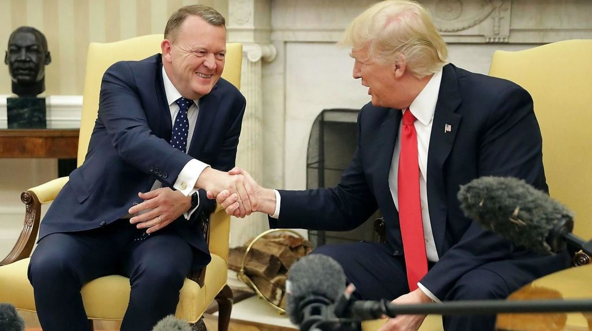

# Alle deltager i demokratiet vi har

> Der skal ikke meget fantasi til at forestille sig en orkan af perverterede idéer som har fået støtte til fremning af afstumpede holdninger.  Holdninger og overbevisninger som ikke har bund i nogen form for tal eller bare observationer fra forige årti. At man ikke gør noget ved ubahagelige ting man ser, gør bare en til en del af problemet.

At vi med så meget information i lommen stadig kan have en ignorant holdning er for mange ubegribeligt. Mange gange mødes man med kognitiv deconans når man præsenterer aktuelle data og hændelser. Som skizofren bliver jeg i dårligt humør når raske mennesker ikke kan blive enige om hvad der lige er sket. Ultimativt må man bøje sig for at **dum** er en ufattelig stærk kraft, selvom vi lever i en verden hvor informationer aldrig har været mere tilgængelig. Underholdningsværdien i **"tåbelige mennesker gør tåbelige ting"** er høj, og det er forandringen i befolkningen også. I en sær kædereaktion hvor **idioti** er blevet *profitabelt*, er målet for ens begrænsede tid på kloden bare **"ikke at være Amalie"** (beklager en uddateret reference, ser ikke reality shows fordi de som udgangspunkt er alt andet end dét)

Mennesker i frit fald fra et fly med jorden uden faldskærm er de eneste der i god mening ikke ønsker yderligere udvikling af situation. I alle andre situationer er hæmninger i udvikling sket for at malke et marked som står til at blive forandret betydeligt. En nostalgisk fornemmelse bør bare ikke være grundlaget for udryddelsen af menneskeheden som vi kender den. Så at fremme udvikling på alle fronte, om det er hvordan vi alle kan leve i fred, eller hvordan at ingen på verdensplan burde sulte når vi allerede producerer nok til alle. Vi er på vej mod en tid hvor lande grænser er vage forståelser for ens ageren og accent. Der er med internettet skabt en global kommunikationslinje hvorved afstanden mellem os er én armlængde.

Tager man springende i teknologi vi bruger i betragtning fra de sidste 10 år og perspektiverer det til en livstid, er muligheder for hvad vi kan opleve eksponentielt stigende. Nysgerrighed har aldrig haft det bedre.

Den del af medaljen vi så skal starte med at tale om, er den hvor muligheder ikke er lige så let tilgængelige. Det er svært at bryde et mønster når man ikke kender andet. Desværre er det alt for nemt at være ligeglad med sine medmennesker, men denne tankegang har historisk set endt civilationer. Fra politikeres synspunkt er opdelingen dog hovedindkomsten, og derfor er det bedre at borgere skændes om uligehed blandt køn, i stedet for uligehed bland rige og fattige.

Interesse konflikt er et ord der i den sammenhæng burde nævnes på daglig basis. Der er en ufattelig kapital i at mene noget bestemt på TV, og samtidig "reformere" skolen, eller SKAT, som to eksempler. Kigger man tilbage på sin folkeskole har der aldrig været planer om at undervise i hvordan markeder fungerer, eller hvad der står i grundloven for den sags skyld. Der er åbenbart 30 menneskerettigheder, hvor jeg kender 0 af dem. Ydermere får man indtrykket af at det er svært at være politiker. Jeg vil så påstå at med den logik, vil man kunne mene at folk uden ben har svært ved at løbe, ligesom det er svært at være fornuftig uden kognitive evner. Der bliver ikke løbet uden groft indgreb. Så at værdien i en absurd mening på TV er så høj skaber nysgerrighed for hvem der støtter. Vi er trodsalt et flok dyr, så at gå i mod sin flok kræver et godt incitament.

Der er mere end nok resurser til at hæve trivslen hos alle, hvis ikke rige fik mindst 7 cifre i bonus trods underskud. At vi uddanner afkom med de bedste betingelser kan sagtens ske, men så længe SKAT giver vores skattekroner til enhver med et CVR nr, så rager det ikke dem vi har stemt på. Jeg vil gerne call'e at ingen der stemmer **for** krig har nogen form for familie i militæret. Indoktrinering af regeringen er en uhyggelig tanke når man har set en historie dokumentar.

I sidste ende må man erkende at magt forpurer, og at politikere kan stemme sig selv til mere magt er der jeg står af. Politik er en public service, så når Søren Pind mener at han tjener dronningen, ikke folket, så væmmes jeg ved det ækle primitive og grådige sind bag hans pande. Et direkte demokrati hvor borgere stemmer på lovforslag i stedet for dukker der koster en formue, vil være et retfærdigt udgangspunkt. Med blockchain teknologien er det muligt at fjerne mellemmænd med "smart contract", som essentielt er en kontrakt hvor kode er lov. Med dem kan man programmere en DAO [(Decentraliseret Autonom Organisation)](https://en.wikipedia.org/wiki/Decentralized_autonomous_organization "wiki artikel om DAO") som selvfølgelig er open source, så man [ikke ender med endnu en KMD katastrofe](http://finans.dk/finans/politik/ECE9297475/efter-milliarder-spildt-paa-offentlige-itskandaler-politisk-flertal-aabner-for-ny-og-kontroversiel-kurs/ "artikel på finans hvor kmd blandt andet nævnes").

Vi er alle medskyldige i Helle Thorning og Lars Løkke, som umuligt kan være de bedst kvalificerede til statsminister posten. Måden at undgå tragikomiske øjeblikke hvor Lars og Donny bliver filmet sammmen, bør alle der er valgbare tage stilling til om dem der repræsenterer os er mere end de grådige snyltere de selv er så meget imod.

## Bryder du dig om synet?

