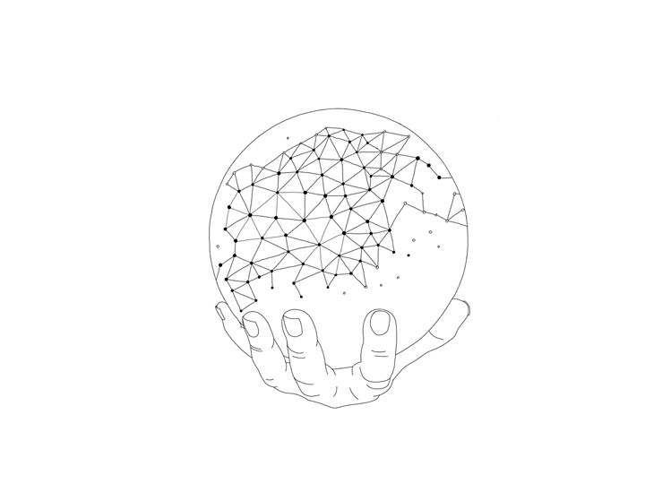

# Evidens Listen

## Hvad er formålet med Evidens listen?

Evidens listen er et politisk projekt som er kommet til live af "fuck it" mentaliteten som #45's har bragt til live ved at blive præsident trods udiagnostiseret handicap.

Det er mere end nemt at spolere logikken der bruges af verdens mest kendte baby, men at reagere positivt er langt fra ligeså let. Det er ærgerligt at han blev valgt. Især når det der lå til grund for det overvejes. Med flere problemer belyst er der dog en positiv vinkel, hvor en modreaktion samler gennemslagskraft.

At [der skal gøres noget ved den politiske struktur](Fremtidssyn.md "Dokument med en sanslynlig fremtid") er nu mere end åbenlyst. Som semi-rationelt menneske får jeg en dårlig smag i munden af at der ikke sættes ind, som er derfor at konklusionen må blive; selv at gå ind i politik. Det står for mig klart at vi alle er i samme båd og at vi alle tager demokrati alvorligt ved at engagerer os bedre.

> Kort sagt: [**Fjern magtliderlige tåber fra deres plads**](Stil_op.md "Kort gennemgang af at stille op til kommunalvalg")
>
> Hvis vi skal kunnne blive ved med at bestemme over vores eget liv nytter det ikke at Søren Pind vil sporer os hvorend vi er på alle tidspunkt. Hvor USA måske har valgt sin sidste præsident, så har vi stadig en chance for at gøre Danmark et skønt sted for alle.

## Fra principper til handling

Fra Wing Chun har jeg lært at man ikke kan bekæmpe *hård* med *hård*, men med *blød*. At grave sig ned i sin hule med sit arsenal af gylle er fristende, for skal man ændre en holdning skal man igennem kognitiv deconans. Had og vold fører til mere had og vold. At sund fornuft kan tolkes ligger langt væk i og med at vi i dag har massere af data til at påvise hvorvidt en idé er god eller ej. Det nytter ikke noget at stille sig på bagben ved ny viden som strider overens med en holdning, for så ville vi stadig have hekse brændinger og guillotiner.

### Brug information til at forbygge *dum* og mindske den i størst mulig omfang

 **HUSK:** #45 vil gerne date sin datter, **OG HUSK** at han, på trods af grav chikane mod et utal af piger og kvinder, lagt sammen løgn og racisme, er kommet til magt der er langt ud over hans fatteevne.

Selv vil jeg gøre gøre hvad jeg kan for stille op i **Kommunalvalget 2017**, og jeg opfordrer alle andre til at gøre det samme!

#### Lars Løkke Rasmussen kan umuligt være den bedst kvalificerede til statsminister... Just sayin

